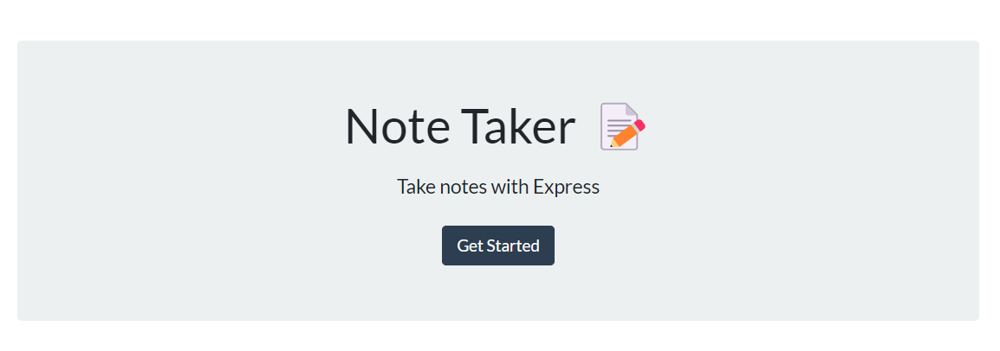

  

## Note Taker App

### Description
A simple note taker application where the user can create and save notes which can be viewed at a later time. The app uses an express.js backend that serves two categories of files 1) static webpage files (html, javascript, css) and 2) API endpoints to view the notes json data file. 

### Usage
When opening the application, the user will find themselves at the Note Taker landing page. To move into the note functionality, they will need to click 'Get Started'.

#### New Note
To create a new note, simply click the add icon "+" on the top right. This will prompt the user to enter the notes title and description. Once the note is finished, the user can save the note by clicking the "save" on the top right. This floppy disk save icon will only appear once a note has both a title and description.

#### View Previous Notes
When a new note is created, the note will be stored in the left hand column. If a user wants to view the note, they can click on the title within the left hand side. This will generate the noted within the main title/description section.

#### API Endpoint
To view a JSON style response for previously saved notes, simply add '/api/notes' to the end of the URL.

### Deployment
The app is deployed on Heroku and can be found [here](https://note-taker-nnavarr.herokuapp.com/)

